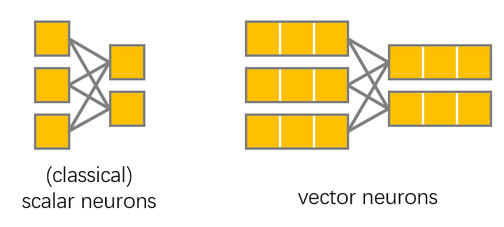

# Vector Neurons: A General Framework for SO(3)-Equivariant Networks

Created by <a href="https://cs.stanford.edu/~congyue/" target="_blank">Congyue Deng</a>, <a href="https://orlitany.github.io/" target="_blank">Or Litany</a>, <a href="http://ivg.au.tsinghua.edu.cn/people/Yueqi_Duan/" target="_blank">Yueqi Duan</a>, <a href="https://scholar.google.com/citations?user=zsGbyGYAAAAJ&hl=fr" target="_blank">Adrien Poulenard</a>, <a href="https://taiya.github.io/" target="_blank">Andrea Tagliasacchi</a>, and <a href="http://geometry.stanford.edu/member/guibas/" target="_blank">Leonidas Guibas</a>.

We introduce a general framework built on top of what we call Vector Neurons for creating SO(3) equivariant neural networks. Extending neurons from single scalars to 3D vectors, our vector neurons transport SO(3) actions to latent spaces and provide a framework for building equivariance in common neural operations including linear layers, non-linearities, pooling, and normalization.

This repo only contains classification and segmentation experiments, for neural implicit reconstruction please see [here](https://github.com/FlyingGiraffe/vnn-neural-implicits/).

[[Project]](https://cs.stanford.edu/~congyue/vnn/) [[Paper]](https://arxiv.org/pdf/2104.12229.pdf)

## Overview
`vnn` is the author's implementation of Vector Neuron Networks with PointNet and DGCNN backbones. The current version only supports input data without normals.

 &nbsp;&nbsp;&nbsp;&nbsp;&nbsp;&nbsp; 

## Data Preparation

+ Classification: Download [ModelNet40](https://shapenet.cs.stanford.edu/media/modelnet40_normal_resampled.zip) and save in `data/modelnet40_normal_resampled/`.
+ Part Segmentation: Download [ShapeNet](https://shapenet.cs.stanford.edu/media/shapenetcore_partanno_segmentation_benchmark_v0_normal.zip)  and save in `data/shapenetcore_partanno_segmentation_benchmark_v0_normal/`.

## Usage

### Classification on ModelNet40
Training
```
python train_cls.py --model vn_pointnet_cls --rot ROTATION --log_dir LOG_DIR
```
```
python train_cls.py --model vn_dgcnn_cls --rot ROTATION --log_dir LOG_DIR
```
Evaluation
```
python test_cls.py --model vn_pointnet_cls --rot ROTATION --log_dir LOG_DIR
```
```
python test_cls.py --model vn_dgcnn_cls --rot ROTATION --log_dir LOG_DIR
```
Here `ROTATION` should be chosen from `aligned`, `z`, `so3`. For instance, to train a VN-DGCNN on aligned shapes and test it on SO(3)-rotated shapes, run
```
python train_cls.py --model vn_dgcnn_cls --rot aligned --log_dir vn_dgcnn/aligned/
```
```
python test_cls.py --model vn_dgcnn_cls --rot so3 --log_dir vn_dgcnn/aligned/
```

### Part Segmentation on ShapeNet

Training
```
python train_partseg.py --model vn_pointnet_partseg --rot ROTATION --log_dir LOG_DIR
```
```
python train_partseg.py --model vn_dgcnn_partseg --rot ROTATION --log_dir LOG_DIR
```
Evaluation
```
python test_partseg.py --model vn_pointnet_partseg --rot ROTATION --log_dir LOG_DIR
```
```
python test_partseg.py --model vn_dgcnn_partseg --rot ROTATION --log_dir LOG_DIR
```
For instance, to train a VN-DGCNN on aligned shapes and test it on SO(3)-rotated shapes, run
```
python train_partseg.py --model vn_dgcnn_partseg --rot aligned --log_dir vn_dgcnn/aligned/
```
```
python test_partseg.py --model vn_dgcnn_partseg --rot so3 --log_dir vn_dgcnn/aligned/
```

## Citation
Please cite this paper if you want to use it in your work,

    @article{deng2021vn,
      title={Vector Neurons: a general framework for SO(3)-equivariant networks},
      author={Deng, Congyue and Litany, Or and Duan, Yueqi and Poulenard, Adrien and Tagliasacchi, Andrea and Guibas, Leonidas},
      journal={arXiv preprint arXiv:2104.12229},
      year={2021}
    } 

## License
MIT License

## Acknowledgement
The structure of this codebase is borrowed from this pytorch implementataion of [PointNet/PointNet++](https://github.com/yanx27/Pointnet_Pointnet2_pytorch) and [DGCNN](https://github.com/WangYueFt/dgcnn) as well as [this implementation](https://github.com/AnTao97/dgcnn.pytorch).
